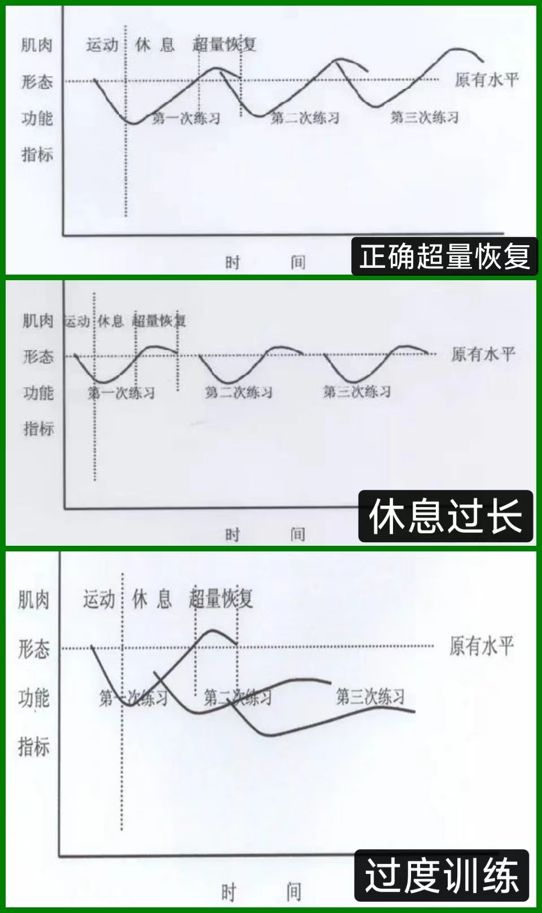

# 训练的基本原则和马拉松能力拆分

## 训练的基本逻辑：渐进超负荷

所有人都知道经过锻炼以后，所锻炼的能力就会变强。但要训练，就必须明白为什么会变强以及如何变强的，我们能看到很多人一味猛练，包括各种文艺作品中都塑造出很多练完后马上变强的印象，然而实际上这种印象是错误的。

- **训练到底是什么**
实际上锻炼是一个“刺激-适应强化”的过程，是由于外界的刺激使人体对应地发生适应。

人体为了适应外界刺激会被动地强化某些方面的能力，事实上刺激并不只能来源于锻炼，虽然（肌肉电刺激，Electro Muscle Stimulation，简称 EMS）的效果并不够好，但确实可以同样达到刺激肌肉生长的效果。

由于人体对于刺激都会产生超量的适应。训练本质上是破坏相关的机能，然后等待恢复的过程。换句话说，训练的过程人并不会变强，但在恢复过程中由于超量恢复作用的存在，在完成恢复后一般都会获得比原来更强的能力。

所以我们最需要知道的其实是，**变强的过程发生于人体的恢复中**。

因此主动训练，本质上就是要主动地掌控这个“刺激-适应强化”的过程；而科学训练，就是要基于已知的更科学的方式让这个过程更高效。

- **渐进超负荷**
但是知道了这些以后我们要，怎么做呢？答案是渐进超负荷。

渐进超负荷在健美/健体圈子里可以说是耳熟能详，但跑步的往往只知道“循序渐进”，却很少细化到这一点上。

对于训练和超量恢复的效果，可以参考下图。

从图上可以看到，无论是过长的休息还是过短的休息都会让我们达不到预想的效果，因此我们在制定训练计划时就要充分注意训练的节奏，留出恢复的空间。

训练是破坏，恢复才是变强。

## 马拉松需要的能力拆分

通常情况下，一个人接触到训练，最朴素的思维一般都会是“我想在哪个项目中取得成功，就去不断练习这个项目，最终越来越接近目标”。换到马拉松上就是“我先跑到目标配速，然后使用目标配速越跑越长，最后就能跑到需要的成绩”。

但很明显的是这种训练方式并不科学，效率也非常低。虽然它也确实是利用了超量恢复的基本逻辑，但对于马拉松而言，如果每天都用接近目标的距离去训练，只会带来过大的负荷，并且效率不高。

对健美/健身有了解过的一定会知道一个词“X分化”，例如“三分化”、“五分化”等。这个词的意思是将一周的训练分为几个部分，分别针对不同肌群进行锻炼，这样可以更加专注于特定肌群的训练，从而提高训练效率。‌

我们也可以借鉴一下健美/健体练的方法，拆解需要的能力，然后针对性强化提升。

回到跑步上，它可以被拆分成很多方面的能力，包括基础有氧能力、乳酸代谢能力、一定的爆发力甚至是比赛过程中的吸收代谢能力。我们需要做的是针对这些个不同方面的能力，采用最高效的训练来对应地提高，而不是一味地全方位给压力。

跑步的能力拆解和已知的训练方式可以参考下图。

