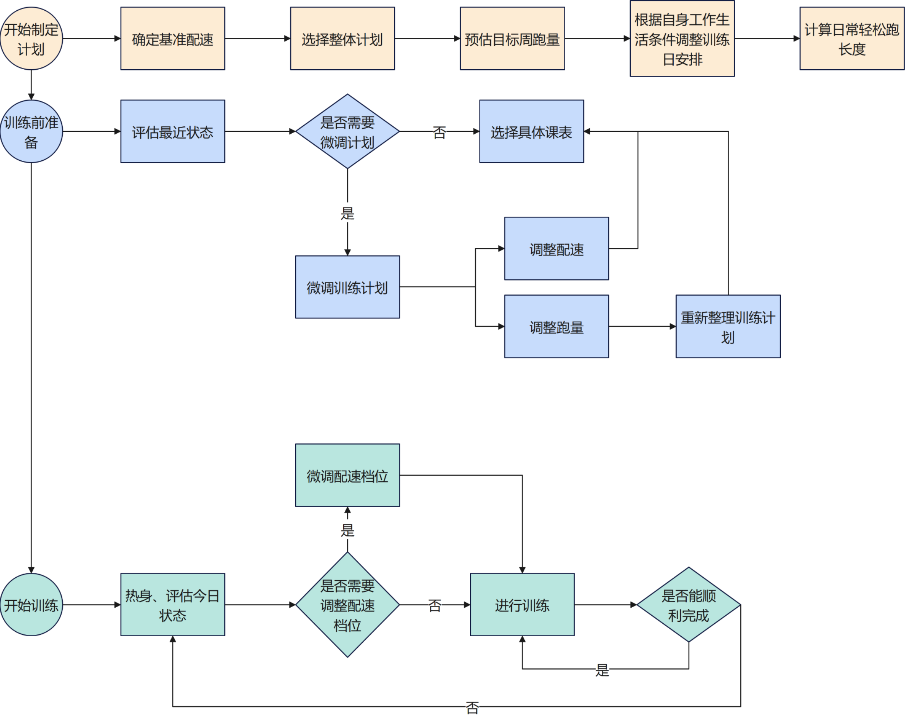

# 课表制定内容

制定计划	1. 首先进行计划制定，先确定基准配速	
	2. 选择适合自己的训练计划	
	3. 预估目标周跑量并记录	
	4. 根据自身情况调整训练日安排	
	5. 根据预估的目标周跑量，计算日常轻松跑长度	
训练前准备	1. 每次开始训练前或开始一个新周期训练前都对最近状态进行简单评估，考虑是否需要调整课表。例如前两天刚经历了一场全力输出的半马或十公里，感觉身体略微疲惫，于是将强度课改为轻松跑；或者前一周因为生活工作原因没有完成强度课，这周需要增加少许负荷；	
	2. 如果需要微调训练计划，那对计划进行调整，然后执行新的训练计划，否则直接根据预定课表进行训练	
训练中的调整	1. 一般情况下，强度课前都建议进行几公里的热身跑，使用E跑强度即可。可以从家里出发跑到训练场地，如果两三公里后感觉没有完全热身开，可以再进行一组快速的渐加速跑，例如从轻松跑开始，每过400-500m提一次速，一直提到接近或达到目标配速。这一部分的量都可以计算到日常堆量的E跑中。	
	2. 根据热身情况对今天的状态进行评估，选择下一组使用哪一档配速进行训练。训练档位可以参配速基准表。	
	3. 每一组或每一段距离跑完，都可以对当前状态进行评估，看是否需要调整训练，尤其在刚调整了基准配速或是天气发生剧烈变化时会有比较大的体感差异。	
	4. 完成训练后可以按自己的情况选择轻松跑几公里冷身，或进行其他的拉伸冷身。如果选择轻松跑冷身，这部分轻松跑也可以计入堆量的轻松跑里。	
	5. 在使用较高档位训练仍感觉游刃有余时，可以考虑调整基准配速	

6. 关于课表的使用方式及训练模式
6.1 课表会以EMTIR、L、H及“长距离”等形式给出，不限制具体的课表
6.2 关于训练中使用心率还是使用配速进行控制，个人建议是轻松跑参考心率，强度课以配速为准。因为强度课的持续时间多数较短，不可能一开始就达到训练心率。
6.3 关于训练中的强度课占比，所有强度课中，只有处于强度对应配速下的距离才能被算作强度的距离。例如亚索800课表，典型组成是800m的最大摄氧量距离，组间可以完全休息也可以慢跑恢复。假设该次训练的总长度为12km，那么只有8km是达到了最大摄氧量强度的，多余的部分一般情况下全部归于轻松跑跑量。
详细的课表制定和使用方式可以跳转到【课表制定和训练流程】工作表